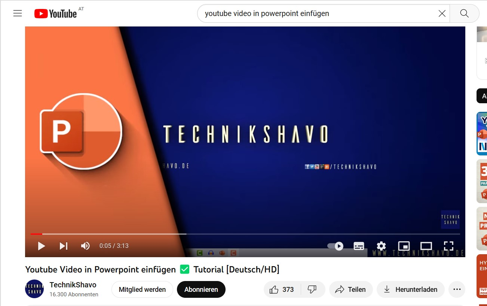
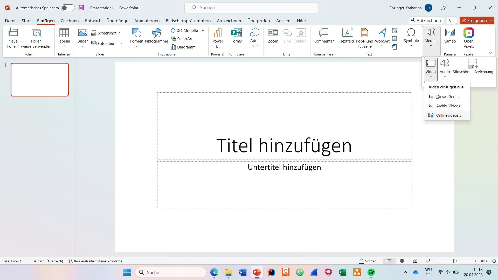
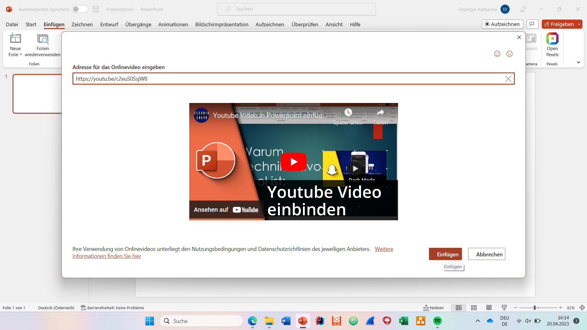

# How to insert a Youtubevideo into powerpoint
Embedding a video from a file directly into a PowerPoint presentation is easy, but it also increases the size of the document. 
To avoid this, you can alternatively work with an embed code and, for example, link a video directly from YouTube to your presentation (e.g. YouTube).
You can also play this back as usual during your presentation and the size of your file will not change.

## Search youtube video

1. Search YouTube for a video that you would like to insert into your PowerPoint presentation.

## Copy link

2.  Then press _Teilen_ and copy the link that appears.

## Paste into presentation

3. Next, go to the powerpoint page where you want to insert the video.
Click: _Einfügen - Medien - Video - Onlinevideos_.

4. Now all you have to do is paste the link and click on _Einfügen_.

5. Now you have already embedded a YouTube video in your PowerPoint presentation.

[Link to a Tutorial](https://youtu.be/c2euS0SsjW8)

