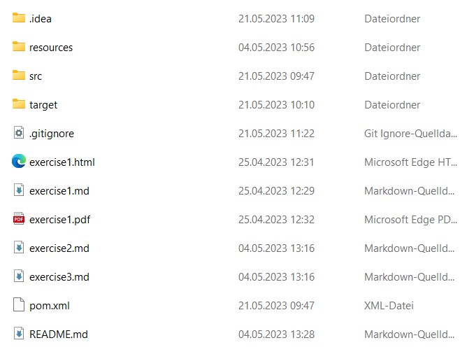
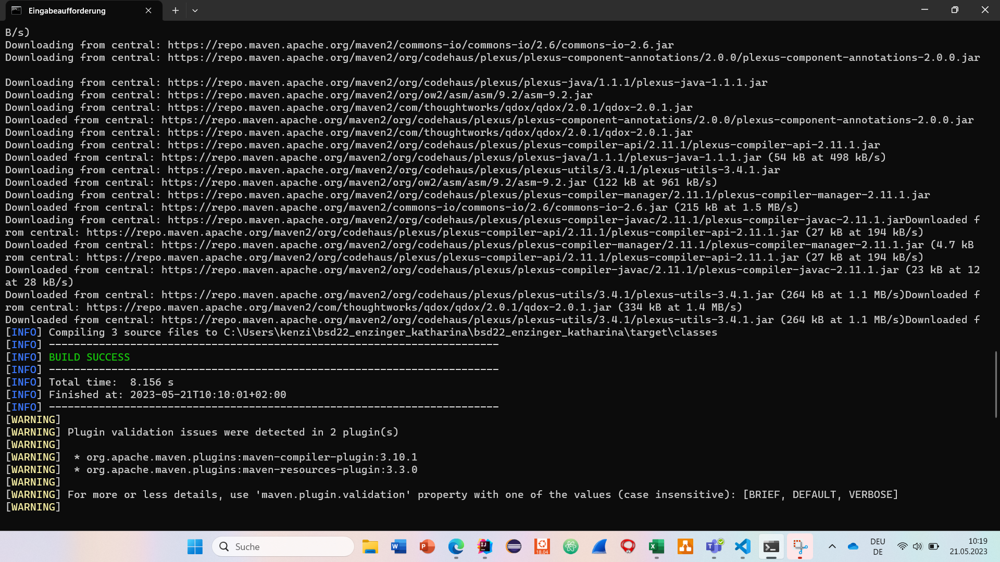

# Exercise 3
## Maven project structure

### First steps

+ Check if Java is installed and set a JAVA_HOME and PATH environment variable.
+ Install Maven and also set variables
+ test with mvn -v whether the program is correctly installed

 

### Create a new project in Intellij

+ (Menü: File > New > Project)
+ The storage location of the existing directory is selected as "Location", where the
Repository cloned using git clone
+ The .idea folder is added to the gitignore file

 

### Create Java class Calculator
+ store in package at.campus02.bsd
+ create specified methods that return values
+ crate Java class Main where the methods are callec

 

### First execution of the program

When the program is run, the "Target" folder is added.
 

### mvn compile

